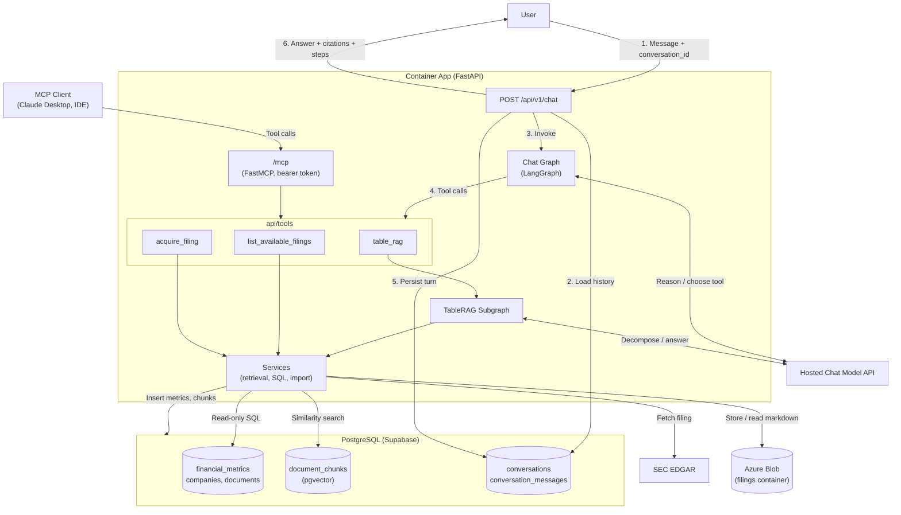
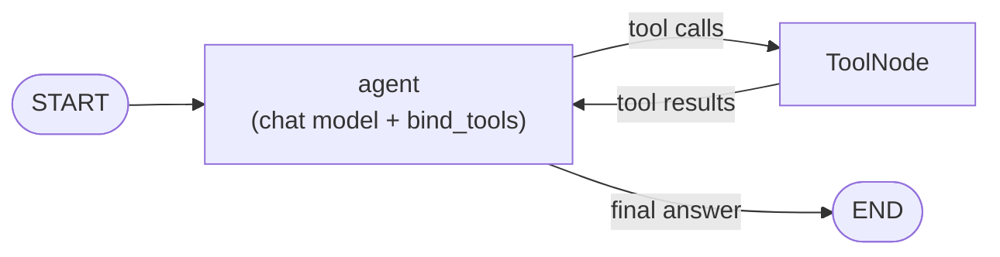
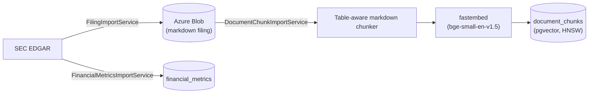
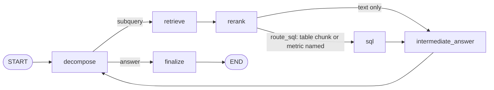
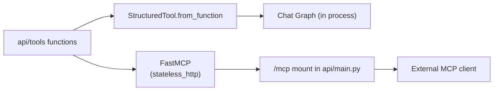

# Financial Data Agent - Architecture

## 1. Overview
Financial Data Agent is an AI-powered assistant for analysing earnings reports for companies in the S&P 500.

A user asks questions in natural language over a multi-turn conversation. A chat agent answers follow-ups from the conversation history and calls tools when it needs data:
- `table_rag` answers grounded questions from structured metrics (SQL) and filing text (pgvector), following TableRAG (arXiv 2506.10380).
- `list_available_filings` reports which filings are already ingested.
- `acquire_filing` fetches a missing filing from SEC EDGAR and ingests it.

The same tools are exposed to external clients over MCP.

Primary use cases include:
- Financial metric lookup
- Earnings analysis
- Company comparisons
- Research question answering

## 2. High-level Architecture

Dependencies are one-way: `api/v1` and `api/tools` → `agent` → `services` → `db/repositories` → `db/models`, with `ingestion/` for external I/O. `agent/` never imports `api/`; routes and tools construct the graphs and inject the chat model, embedder and session.

## 3. Chat Agent
The chat agent is a LangGraph `StateGraph` over `MessagesState` in `agent/chat_graph.py`. The `agent` node is the chat model with the tools bound via `bind_tools`; `tools_condition` routes to a `ToolNode` while the model emits tool calls and to `END` once it answers.

- **Step bound.** `recursion_limit` is the hard cap on graph steps. A run that hits it raises instead of spinning.
- **Acquisition budget.** A counter in chat state caps SEC round-trips per request. The `acquire_filing` wrapper checks it and returns a refusal message to the model once it is spent.
- **Follow-ups.** Prior turns are replayed as messages, so the model answers from history without a tool call when the answer is already in context.
- **Chat model seam.** The graph accepts a langchain-core `BaseChatModel`. `ingestion/llm.py` `build_chat_model()` constructs it from `LLM_PROVIDER` and `LLM_MODEL` (required, no default) and imports the provider package inside the branch that needs it.

## 4. TableRAG Tool
`table_rag` runs the TableRAG loop as a LangGraph subgraph in `agent/tablerag/`. It is the grounded-answer path; the chat agent decides when to use it.

### 4.1 Offline construction

### 4.2 Online loop

- The schema is fixed (`financial_metrics` joined to `documents` and `companies`) and fits in the prompt, so there is no per-document schema extraction. Chunk metadata `(ticker, year, quarter)` supplies SQL filters.
- `route_sql` runs SQL when any reranked chunk has `is_table = true` or the subquery names a metric in `METRIC_FIELDS`.
- SQL runs on a read-only transaction; the statement guard is defence in depth.
- When retrieval and SQL both come back empty for a `(ticker, year, quarter)`, the subgraph reports the gap instead of acquiring. Acquisition is the chat agent's decision.
- The result carries the answer, citations (`accession_number`, `chunk_index`, `heading_path`) and a per-subquery `steps` trace.

## 5. Tools and MCP
Tools live in `api/tools/`. Like `api/v1` routes, they are thin: they call services and translate service exceptions into tool errors.

| Tool | Backed by | Reads / writes |
| --- | --- | --- |
| `table_rag(question, tickers?, years?, quarters?)` | TableRAG subgraph → `services/chunk_retrieval.py`, `services/sql_query.py` | Supabase metrics (SQL) and chunks (pgvector) |
| `list_available_filings(ticker?)` | `DocumentRepository` | Supabase `documents` and chunk counts |
| `acquire_filing(ticker, year, quarter)` | `FilingImportService`, `FinancialMetricsImportService`, `DocumentChunkImportService` | SEC → Azure Blob → Supabase; re-chunks from the stored blob when the filing exists but has no chunks |

The agent never reads raw blobs. Chunks are the retrievable form of a filing, and `DocumentChunkImportService` reads the blob through `DataStorage.read_text`.

The same functions are registered twice:

- **In process.** The chat graph binds the functions directly and receives the request's session. There is no MCP hop for the app's own agent.
- **Over MCP.** `api/tools/mcp_server.py` registers the functions on a `FastMCP` server with `stateless_http=True`, mounted at `/mcp` via `streamable_http_app()`. Each call opens its own session from `get_session_factory()`. The FastAPI `lifespan` must run `mcp.session_manager.run()`; without it the mount fails on the first request.
- **Auth.** `/mcp` is on the Container App's public ingress. Requests must carry a bearer token matching `MCP_API_KEY`. `acquire_filing` is a write path and is never exposed without it.
- **Rejected: a separate MCP Container App.** It adds a second deployment, a network hop and inter-app auth, with no scaling benefit at `max_replicas = 1`.

## 6. Conversation State
Conversations are stored in two Alembic-managed tables. The graph runs without a LangGraph checkpointer: the chat service loads history, invokes the graph and persists the new turn.

| Table | Columns | Constraints |
| --- | --- | --- |
| `conversations` | `id` UUID (`gen_random_uuid()`), `title` VARCHAR(255) null, timestamps | PK `id` |
| `conversation_messages` | `id`, `conversation_id`, `position` INT, `role` VARCHAR(20), `content` TEXT, `trace` JSONB null, timestamps | FK `conversation_id` → `conversations.id` `ON DELETE CASCADE`; `UNIQUE (conversation_id, position)`; CHECK `role IN ('user', 'assistant')` |

- Only user messages and final assistant answers are stored. Tool calls, citations and `steps` go in the assistant row's `trace`, so replayed context stays bounded.
- **Rejected: `langgraph-checkpoint-postgres`.** It creates its own tables outside Alembic, the same reason `langchain-postgres` was rejected for the vector store. `migrations/versions/` stays the single source of truth for the schema.

API:
- `POST /api/v1/chat` — `{conversation_id?, message}` → `{conversation_id, answer, citations, steps}`.
- `GET /api/v1/conversations/{id}` — the stored messages.

## 7. Deployment
Everything runs in the existing single Azure Container App (0.5 vCPU / 1 GiB, `max_replicas = 1`). No new Azure resource is added.

- **Embeddings** run in process with `fastembed` on onnxruntime, for both ingestion and queries.
- **The chat model is an external hosted API** with a free tier, called over HTTPS. It is not self-hosted — a chat model does not fit the container's CPU and memory, and CPU inference is too slow for the multi-step TableRAG loop. Azure AI Foundry and Azure OpenAI are not used. It is the Gemini API free tier; the provider must support tool calling, and the evaluation harness chooses the model.
- **Secrets** follow the existing Terraform `secrets` / `secret_env_vars` pattern: `database-url`, the LLM API key and `MCP_API_KEY`. `LLM_PROVIDER` and `LLM_MODEL` are plain `env_vars`. The container-app module is unchanged.
- **Privacy.** Free tiers may use prompts for training. Filings are public; user messages are not. The chosen tier's data terms are part of the provider decision.
