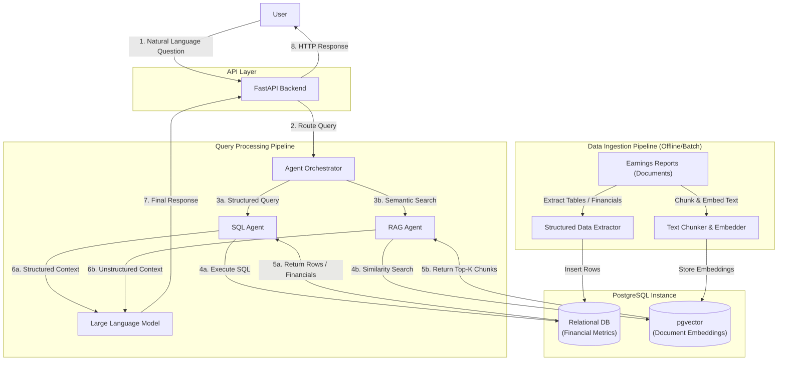

# Financial Data Agent - Architecture

## 1. Overview
Financial Data Agent is an AI-powered assistant for analysing earnings reports for companies in the S&P 500.

The system combines three core capabilities:
- Structured financial data querying using SQL
- Semantic retrieval over financial documents using vector search
- Agent-based orchestration for selecting the appropriate tools

Primary use cases include:
- Financial metric lookup
- Earnings analysis
- Company comparisons
- Research question answering

## 3. High-level Architecture

## 4. Components
### FastAPI backend
